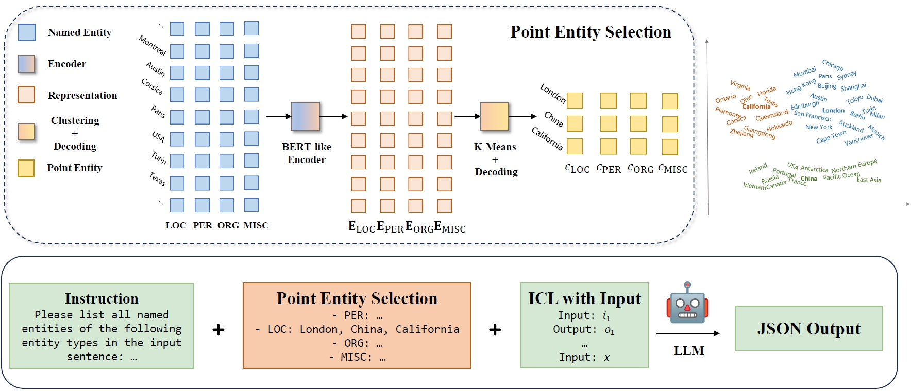

# P-ICL

## Data Preparation
Please save your dataset in `data` folder. Note that CoNLL2003 and WNUT2017 are open-source datasets, ACE2004 and ACE2005 are not free. We keep our CoNLL2003 and WNUT2017 train and test JSON files in `data` folder.

- CoNLL2003: [https://huggingface.co/datasets/conll2003](https://huggingface.co/datasets/conll2003)
- WNUT2017: [https://huggingface.co/datasets/wnut_17](https://huggingface.co/datasets/wnut_17)
- ACE2004: [https://catalog.ldc.upenn.edu/LDC2005T09](https://catalog.ldc.upenn.edu/LDC2005T09)
- ACE2005: [https://catalog.ldc.upenn.edu/LDC2006T06](https://catalog.ldc.upenn.edu/LDC2006T06)

## Generation

## Evaluation
